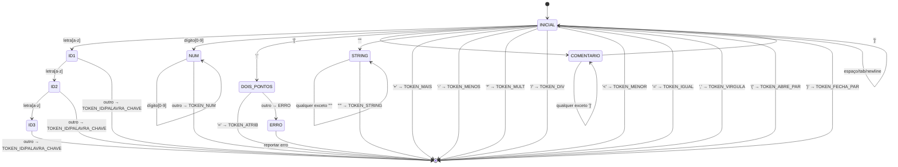

# AFD - Autômato Finito Determinístico para Linguagem X25a

## Diagrama Completo do AFD



## Estados do AFD

### Estados Principais:

1. **INICIAL (q0)** - Estado inicial, aguardando próximo caractere
2. **ID1, ID2, ID3** - Reconhecendo identificadores (1, 2 ou 3 letras)
3. **NUM** - Reconhecendo números inteiros
4. **DOIS_PONTOS** - Reconheceu ':', aguardando '=' para formar ':='
5. **COMENTARIO** - Dentro de um comentário [...]
6. **STRING** - Dentro de uma string '...'
7. **ERRO** - Estado de erro

### Estados Finais (geram tokens):

- ID1, ID2, ID3 → TOKEN_ID ou PALAVRA_CHAVE
- NUM → TOKEN_NUM
- DOIS_PONTOS + '=' → TOKEN_ATRIB
- STRING + "'" → TOKEN_STRING
- Operadores simples → Tokens diretos

## Tokens Reconhecidos

### 1. Palavras-Chave (Keywords):
- `LEIA`
- `ESCREVA`
- `SE`
- `ENTÃO` (ou `ENTAO`)
- `SENÃO` (ou `SENAO`)
- `FIM`
- `FAÇA` (ou `FACA`)
- `ENQUANTO`

### 2. Identificadores (ID):
- Sequência de 1 a 3 letras minúsculas [a-z]
- Exemplos: `x`, `num`, `fat`, `a`, `tot`

### 3. Números (NUM):
- Sequência de dígitos [0-9]+
- Exemplos: `0`, `1`, `123`, `999`

### 4. Operadores:
- **Atribuição**: `:=`
- **Aritméticos**: `+`, `-`, `*`, `/`
- **Relacionais**: `<`, `=`

### 5. Delimitadores:
- `,` (vírgula - separador)
- `(` (abre parênteses)
- `)` (fecha parênteses)

### 6. Literais:
- **STRING**: texto entre apóstrofes `'mensagem'`

### 7. Comentários:
- `[comentário]` - são ignorados, não geram tokens

## Regras de Transição

### Para Identificadores:
```
INICIAL --[a-z]--> ID1
ID1 --[a-z]--> ID2
ID2 --[a-z]--> ID3
ID3 --[a-z]--> ERRO (máximo 3 letras!)

ID1, ID2, ID3 --[não letra]--> FIM (verifica se é palavra-chave)
```

### Para Números:
```
INICIAL --[0-9]--> NUM
NUM --[0-9]--> NUM
NUM --[não dígito]--> FIM
```

### Para Atribuição:
```
INICIAL --[:]--> DOIS_PONTOS
DOIS_PONTOS --[=]--> FIM (token :=)
DOIS_PONTOS --[outro]--> ERRO
```

### Para Comentários:
```
INICIAL --[[]--> COMENTARIO
COMENTARIO --[^]]--> COMENTARIO
COMENTARIO --[]]--> INICIAL (volta, sem gerar token)
```

### Para Strings:
```
INICIAL --[']--> STRING
STRING --[^']--> STRING
STRING --[']--> FIM (token STRING)
```

## Tratamento de Erros

1. **Identificador muito longo**: mais de 3 letras
2. **':' sem '='**: dois pontos sozinho
3. **Comentário não fechado**: fim de arquivo dentro de [...]
4. **String não fechada**: fim de arquivo dentro de '...'
5. **Caractere inválido**: símbolo não reconhecido

## Tabela de Transição (resumida)

| Estado       | a-z  | 0-9  | :    | =    | <    | +    | -    | *    | /    | ,    | (    | )    | [    | ]    | '    | espaço |
|--------------|------|------|------|------|------|------|------|------|------|------|------|------|------|------|------|--------|
| INICIAL      | ID1  | NUM  | DP   | =T   | <T   | +T   | -T   | *T   | /T   | ,T   | (T   | )T   | COM  | ERR  | STR  | INIC   |
| ID1          | ID2  | FIM  | FIM  | FIM  | FIM  | FIM  | FIM  | FIM  | FIM  | FIM  | FIM  | FIM  | FIM  | FIM  | FIM  | FIM    |
| ID2          | ID3  | FIM  | FIM  | FIM  | FIM  | FIM  | FIM  | FIM  | FIM  | FIM  | FIM  | FIM  | FIM  | FIM  | FIM  | FIM    |
| ID3          | ERR  | FIM  | FIM  | FIM  | FIM  | FIM  | FIM  | FIM  | FIM  | FIM  | FIM  | FIM  | FIM  | FIM  | FIM  | FIM    |
| NUM          | FIM  | NUM  | FIM  | FIM  | FIM  | FIM  | FIM  | FIM  | FIM  | FIM  | FIM  | FIM  | FIM  | FIM  | FIM  | FIM    |
| DOIS_PONTOS  | ERR  | ERR  | ERR  | :=T  | ERR  | ERR  | ERR  | ERR  | ERR  | ERR  | ERR  | ERR  | ERR  | ERR  | ERR  | ERR    |
| COMENTARIO   | COM  | COM  | COM  | COM  | COM  | COM  | COM  | COM  | COM  | COM  | COM  | COM  | COM  | INIC | COM  | COM    |
| STRING       | STR  | STR  | STR  | STR  | STR  | STR  | STR  | STR  | STR  | STR  | STR  | STR  | STR  | STR  | FIM  | STR    |

**Legenda:**
- `T` = Token gerado diretamente
- `FIM` = Estado final, retorna token
- `ERR` = Erro
- `DP` = DOIS_PONTOS
- `COM` = COMENTARIO
- `STR` = STRING
- `INIC` = INICIAL
