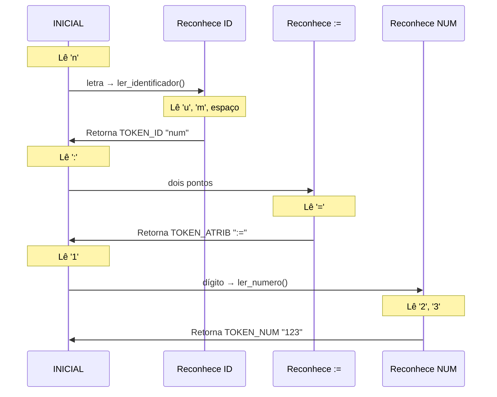

# AFD - Autômato Finito Determinístico para Linguagem X25a

## Diagrama Completo do AFD

```mermaid
stateDiagram-v2
    [*] --> INICIAL
    
    %% Identificadores e Palavras-chave
    INICIAL --> ID1: letra a-z ou A-Z
    ID1 --> ID2: letra
    ID2 --> ID3: letra
    ID1 --> FIM_ID: não letra
    ID2 --> FIM_ID: não letra
    ID3 --> FIM_ID: não letra
    FIM_ID --> [*]: TOKEN_ID ou PALAVRA_CHAVE
    
    %% Números
    INICIAL --> NUM: dígito 0-9
    NUM --> NUM: dígito
    NUM --> FIM_NUM: não dígito
    FIM_NUM --> [*]: TOKEN_NUM
    
    %% Atribuição :=
    INICIAL --> DOIS_PONTOS: :
    DOIS_PONTOS --> FIM_ATRIB: =
    FIM_ATRIB --> [*]: TOKEN_ATRIB
    DOIS_PONTOS --> ERRO: outro caractere
    
    %% Comentários [...]
    INICIAL --> COMENTARIO: [
    COMENTARIO --> COMENTARIO: qualquer exceto ]
    COMENTARIO --> INICIAL: ]
    
    %% Strings '...'
    INICIAL --> STRING: '
    STRING --> STRING: qualquer exceto '
    STRING --> FIM_STRING: '
    FIM_STRING --> [*]: TOKEN_STRING
    
    %% Operadores e Delimitadores (diretos)
    INICIAL --> OP_MAIS: +
    OP_MAIS --> [*]: TOKEN_MAIS
    
    INICIAL --> OP_MENOS: -
    OP_MENOS --> [*]: TOKEN_MENOS
    
    INICIAL --> OP_MULT: *
    OP_MULT --> [*]: TOKEN_MULT
    
    INICIAL --> OP_DIV: /
    OP_DIV --> [*]: TOKEN_DIV
    
    INICIAL --> OP_MENOR: <
    OP_MENOR --> [*]: TOKEN_MENOR
    
    INICIAL --> OP_IGUAL: =
    OP_IGUAL --> [*]: TOKEN_IGUAL
    
    INICIAL --> VIRGULA: ,
    VIRGULA --> [*]: TOKEN_VIRGULA
    
    INICIAL --> ABRE_PAR: (
    ABRE_PAR --> [*]: TOKEN_ABRE_PAR
    
    INICIAL --> FECHA_PAR: )
    FECHA_PAR --> [*]: TOKEN_FECHA_PAR
    
    %% Espaços em branco (ignorados)
    INICIAL --> INICIAL: espaço/tab/enter
    
    %% Erro
    ERRO --> [*]: TOKEN_ERRO
```

## Diagrama Alternativo (Flowchart - Mais Visual)

```mermaid
flowchart TD
    Start([INÍCIO]) --> Inicial{Estado INICIAL}
    
    %% Identificadores
    Inicial -->|letra| ID1[ID1: 1 letra]
    ID1 -->|letra| ID2[ID2: 2 letras]
    ID2 -->|letra| ID3[ID3: 3 letras]
    ID1 -->|não-letra| VerificaID1{É palavra-chave?}
    ID2 -->|não-letra| VerificaID2{É palavra-chave?}
    ID3 -->|não-letra| VerificaID3{É palavra-chave?}
    VerificaID1 -->|Sim| TokenKW1[TOKEN_PALAVRA_CHAVE]
    VerificaID1 -->|Não| TokenID1[TOKEN_ID]
    VerificaID2 -->|Sim| TokenKW2[TOKEN_PALAVRA_CHAVE]
    VerificaID2 -->|Não| TokenID2[TOKEN_ID]
    VerificaID3 -->|Sim| TokenKW3[TOKEN_PALAVRA_CHAVE]
    VerificaID3 -->|Não| TokenID3[TOKEN_ID]
    
    %% Números
    Inicial -->|dígito| Num[NUM]
    Num -->|dígito| Num
    Num -->|não-dígito| TokenNum[TOKEN_NUM]
    
    %% Atribuição
    Inicial -->|:| DoisPontos[DOIS_PONTOS]
    DoisPontos -->|=| TokenAtrib[TOKEN_ATRIB]
    DoisPontos -->|outro| Erro1[ERRO]
    
    %% Comentários
    Inicial -->|'['| Coment[COMENTARIO]
    Coment -->|não ']'| Coment
    Coment -->|']'| Inicial
    
    %% Strings
    Inicial -->|'| Str[STRING]
    Str -->|não '| Str
    Str -->|'| TokenStr[TOKEN_STRING]
    
    %% Operadores
    Inicial -->|+| TokenMais[TOKEN_MAIS]
    Inicial -->|-| TokenMenos[TOKEN_MENOS]
    Inicial -->|*| TokenMult[TOKEN_MULT]
    Inicial -->|/| TokenDiv[TOKEN_DIV]
    Inicial -->|<| TokenMenor[TOKEN_MENOR]
    Inicial -->|=| TokenIgual[TOKEN_IGUAL]
    
    %% Delimitadores
    Inicial -->|,| TokenVirgula[TOKEN_VIRGULA]
    Inicial -->|(| TokenAbrePar[TOKEN_ABRE_PAR]
    Inicial -->|)| TokenFechaPar[TOKEN_FECHA_PAR]
    
    %% Espaços
    Inicial -->|espaço/tab/enter| Inicial
    
    %% Finais
    TokenKW1 --> End([FIM])
    TokenKW2 --> End
    TokenKW3 --> End
    TokenID1 --> End
    TokenID2 --> End
    TokenID3 --> End
    TokenNum --> End
    TokenAtrib --> End
    TokenStr --> End
    TokenMais --> End
    TokenMenos --> End
    TokenMult --> End
    TokenDiv --> End
    TokenMenor --> End
    TokenIgual --> End
    TokenVirgula --> End
    TokenAbrePar --> End
    TokenFechaPar --> End
    Erro1 --> End
```

## Estados do AFD

### Estados Principais:

1. **INICIAL (q0)** - Estado inicial, aguardando próximo caractere
2. **ID1, ID2, ID3** - Reconhecendo identificadores (1, 2 ou 3 letras)
3. **NUM** - Reconhecendo números inteiros
4. **DOIS_PONTOS** - Reconheceu ':', aguardando '=' para formar ':='
5. **COMENTARIO** - Dentro de um comentário [...]
6. **STRING** - Dentro de uma string '...'
7. **ERRO** - Estado de erro

### Estados Finais (geram tokens):

- ID1, ID2, ID3 → TOKEN_ID ou PALAVRA_CHAVE
- NUM → TOKEN_NUM
- DOIS_PONTOS + '=' → TOKEN_ATRIB
- STRING + "'" → TOKEN_STRING
- Operadores simples → Tokens diretos

## Tokens Reconhecidos

### 1. Palavras-Chave (Keywords):
- `LEIA`
- `ESCREVA`
- `SE`
- `ENTÃO` (ou `ENTAO`)
- `SENÃO` (ou `SENAO`)
- `FIM`
- `FAÇA` (ou `FACA`)
- `ENQUANTO`

### 2. Identificadores (ID):
- Sequência de 1 a 3 letras minúsculas [a-z]
- Exemplos: `x`, `num`, `fat`, `a`, `tot`

### 3. Números (NUM):
- Sequência de dígitos [0-9]+
- Exemplos: `0`, `1`, `123`, `999`

### 4. Operadores:
- **Atribuição**: `:=`
- **Aritméticos**: `+`, `-`, `*`, `/`
- **Relacionais**: `<`, `=`

### 5. Delimitadores:
- `,` (vírgula - separador)
- `(` (abre parênteses)
- `)` (fecha parênteses)

### 6. Literais:
- **STRING**: texto entre apóstrofes `'mensagem'`

### 7. Comentários:
- `[comentário]` - são ignorados, não geram tokens

## Regras de Transição

### Para Identificadores:
```
INICIAL --[a-z]--> ID1
ID1 --[a-z]--> ID2
ID2 --[a-z]--> ID3
ID3 --[a-z]--> ERRO (máximo 3 letras!)

ID1, ID2, ID3 --[não letra]--> FIM (verifica se é palavra-chave)
```

### Para Números:
```
INICIAL --[0-9]--> NUM
NUM --[0-9]--> NUM
NUM --[não dígito]--> FIM
```

### Para Atribuição:
```
INICIAL --[:]--> DOIS_PONTOS
DOIS_PONTOS --[=]--> FIM (token :=)
DOIS_PONTOS --[outro]--> ERRO
```

### Para Comentários:
```
INICIAL --[[]--> COMENTARIO
COMENTARIO --[^]]--> COMENTARIO
COMENTARIO --[]]--> INICIAL (volta, sem gerar token)
```

### Para Strings:
```
INICIAL --[']--> STRING
STRING --[^']--> STRING
STRING --[']--> FIM (token STRING)
```

## Tratamento de Erros

1. **Identificador muito longo**: mais de 3 letras
2. **':' sem '='**: dois pontos sozinho
3. **Comentário não fechado**: fim de arquivo dentro de [...]
4. **String não fechada**: fim de arquivo dentro de '...'
5. **Caractere inválido**: símbolo não reconhecido

## Tabela de Transição (resumida)

| Estado       | a-z  | 0-9  | :    | =    | <    | +    | -    | *    | /    | ,    | (    | )    | [    | ]    | '    | espaço |
|--------------|------|------|------|------|------|------|------|------|------|------|------|------|------|------|------|--------|
| INICIAL      | ID1  | NUM  | DP   | =T   | <T   | +T   | -T   | *T   | /T   | ,T   | (T   | )T   | COM  | ERR  | STR  | INIC   |
| ID1          | ID2  | FIM  | FIM  | FIM  | FIM  | FIM  | FIM  | FIM  | FIM  | FIM  | FIM  | FIM  | FIM  | FIM  | FIM  | FIM    |
| ID2          | ID3  | FIM  | FIM  | FIM  | FIM  | FIM  | FIM  | FIM  | FIM  | FIM  | FIM  | FIM  | FIM  | FIM  | FIM  | FIM    |
| ID3          | ERR  | FIM  | FIM  | FIM  | FIM  | FIM  | FIM  | FIM  | FIM  | FIM  | FIM  | FIM  | FIM  | FIM  | FIM  | FIM    |
| NUM          | FIM  | NUM  | FIM  | FIM  | FIM  | FIM  | FIM  | FIM  | FIM  | FIM  | FIM  | FIM  | FIM  | FIM  | FIM  | FIM    |
| DOIS_PONTOS  | ERR  | ERR  | ERR  | :=T  | ERR  | ERR  | ERR  | ERR  | ERR  | ERR  | ERR  | ERR  | ERR  | ERR  | ERR  | ERR    |
| COMENTARIO   | COM  | COM  | COM  | COM  | COM  | COM  | COM  | COM  | COM  | COM  | COM  | COM  | COM  | INIC | COM  | COM    |
| STRING       | STR  | STR  | STR  | STR  | STR  | STR  | STR  | STR  | STR  | STR  | STR  | STR  | STR  | STR  | FIM  | STR    |

**Legenda:**
- `T` = Token gerado diretamente
- `FIM` = Estado final, retorna token
- `ERR` = Erro
- `DP` = DOIS_PONTOS
- `COM` = COMENTARIO
- `STR` = STRING
- `INIC` = INICIAL

---

## Diagrama Simplificado (Resumo Visual)

Para facilitar o entendimento, aqui está um diagrama super simplificado dos principais fluxos:

```mermaid
graph LR
    A((INICIAL)) -->|a-z A-Z| B[ID/Palavra-chave]
    A -->|0-9| C[Número]
    A -->|:| D{: seguido de =?}
    D -->|Sim| E[:=]
    D -->|Não| F[ERRO]
    A -->|'| G[String]
    A -->|+,-,*,/| H[Operador]
    A -->|<, =| I[Relacional]
    A -->|(,),| J[Delimitador]
    A -->|'['| K[Comentário]
    K --> A
    
    B --> Final([Token])
    C --> Final
    E --> Final
    F --> Final
    G --> Final
    H --> Final
    I --> Final
    J --> Final
    
    style A fill:#e1f5ff
    style Final fill:#c8e6c9
    style F fill:#ffcdd2
```

## Exemplo Prático de Reconhecimento

### Entrada: `num := 123`



### Tokens gerados:
1. `TOKEN_ID` com lexema "num"
2. `TOKEN_ATRIB` com lexema ":="
3. `TOKEN_NUM` com lexema "123"

---

## Resumo dos Estados Principais

| Estado | O que faz | Vai para |
|--------|-----------|----------|
| **INICIAL** | Aguarda próximo caractere | Vários estados dependendo do caractere |
| **ID1/ID2/ID3** | Reconhece identificador (até 3 letras) | FIM (verifica se é palavra-chave) |
| **NUM** | Reconhece número (vários dígitos) | FIM |
| **DOIS_PONTOS** | Aguarda '=' para formar ':=' | FIM ou ERRO |
| **STRING** | Reconhece texto entre '...' | FIM |
| **COMENTARIO** | Ignora tudo até ']' | INICIAL (volta) |

**Total de estados:** ~20 estados
**Estados finais:** Todos geram tokens (exceto COMENTARIO que volta ao INICIAL)
